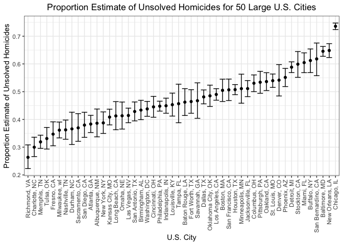
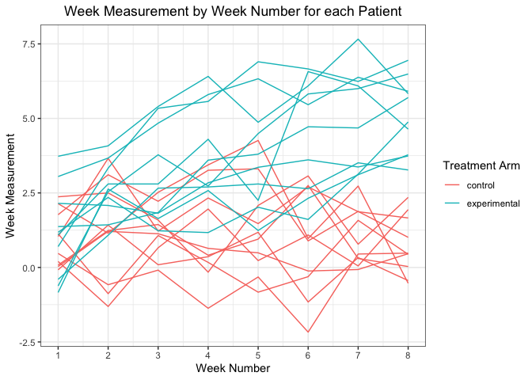

p8105\_hw5\_bpg2118
================
Benjamin Goebel
11/20/2021

## Problem 1

Let’s begin by reading in the data.

``` r
# Read in the homicide data
homicide_data <- read_csv(here("data", "homicide-data.csv"))
```

There are 52179 rows and 12 columns. The average victim age is 31.8
years with 13.8% of victims being female.

Let’s add a city\_state column.

``` r
# Add city_state column
homicide_data <- homicide_data %>%
  mutate(city_state = str_c(city, ", ", state))
```

Now, we can summarize the total number of homicides and unsolved
homicides in each city, state.

``` r
# Summarize total number of homicides and unsolved homicides in each city, state
# Unsolved homicide: disposition == Closed without arrest | disposition ==
#                    Open/No arrest.
city_state_summary_homicides <- homicide_data %>%
  group_by(city_state) %>%
  summarize(
    n_unsolved_homicides = sum(disposition == "Closed without arrest" |
                               disposition == "Open/No arrest"),
    n_homicides = n()
  )
```

As requested, we can estimate the proportion of unsolved homicides in
Baltimore, MD.

``` r
# Get Baltimore summary homicides and then estimate proportion of unsolved
# homicides
baltimore_summary_homicides <- city_state_summary_homicides %>%
  filter(city_state == "Baltimore, MD")
baltimore_prop_test <- prop.test(pull(baltimore_summary_homicides, n_unsolved_homicides),
                                 pull(baltimore_summary_homicides, n_homicides))
```

Next, we can tidy the output from the prop test and view the proportion
estimate, as well as the lower and upper bounds of the confidence
interval.

``` r
# Tidy Baltimore prop test
# Get proportion estimate and lower and upper bounds of the confidence interval
broom::tidy(baltimore_prop_test) %>%
  select(estimate, conf.low, conf.high) %>%
  knitr::kable()
```

|  estimate |  conf.low | conf.high |
|----------:|----------:|----------:|
| 0.6455607 | 0.6275625 | 0.6631599 |

Now, we can get the proportion estimate and lower and upper bounds for
each city.

``` r
# Create a prop test function to apply to any SUMMARIZED city df
city_prop_test_fun <- function(city_df) {
  return(prop.test(pull(city_df, n_unsolved_homicides), 
                   pull(city_df, n_homicides)))
}

# Nest homicide data
# Map prop test (city_prop_test_fun) to each city homicide data
# Map tidy to each prop test
# Select columns
city_state_prop_test <- city_state_summary_homicides %>%
  nest(data = n_unsolved_homicides:n_homicides) %>%
  mutate(
    test_results = map(data, city_prop_test_fun),
    tidy_results = map(test_results, broom::tidy)
  ) %>%
  select(city_state, tidy_results) %>%
  unnest(tidy_results) %>%
  select(city_state, estimate, conf.low, conf.high)
```

Next, we will create a plot that shows the proportion estimates with
confidence intervals for each city. When creating this plot, I noticed
there was one city, Tulsa, AL, with one homicide and zero unsolved
homicides. This is an error since this city does not exist. So, I
filtered out this city when creating the plot.

``` r
# Plot proportion estimate of unsolved homicides for 50 large U.S. cities
# Use geom_errorbar to plot confidence intervals
# Filter out city Tulsa, AL, as this is mis-entered data
city_state_prop_test %>%
  filter(city_state != "Tulsa, AL") %>%
  mutate(city_state = fct_reorder(city_state, estimate)) %>%
  ggplot(aes(x = city_state, y = estimate)) +
  geom_point() +
  geom_errorbar(aes(ymin = conf.low, ymax = conf.high)) +
  theme_bw() +
  labs(
    x = "U.S. City",
    y = "Proportion Estimate of Unsolved Homicides",
    title = "Proportion Estimate of Unsolved Homicides for 50 Large U.S. Cities"
  ) +
  theme(axis.text.x = element_text(angle = 90, vjust = 0.5, hjust = 1),
        plot.title = element_text(hjust = 0.5))
```

<!-- -->

## Problem 2

Let’s do the following: \* Create a data frame with one column being a
list of file names and a second column being a list column of data
frames with each data frame being the corresponding read-in data from
the file name. \* Unnest the list column of data frames.  
\* Pivot the data so that week is in one column and the week measurement
is in another column.  
\* Create patient ID and treatment variables, as well as, a variable
that combines the patient ID and treatment to uniquely identify each
patient.

``` r
# Create a data frame with a list of file names and list of patient data frames
# Get list of data frames by iterating over file names list and read_csv
# Unnest list column
# Pivot to get week in one column and week measurement in another
# Create patient ID and treatment variables and create a variable of the
# combination of the two to uniquely identify each patient.
longitudinal_df <- tibble(
  file_names = list.files(here("data", "problem_two_longitudinal_data")),
  patient_data = map(.x = file_names, 
                     ~read_csv(here("data", 
                                   "problem_two_longitudinal_data", .x)
                              )
                     )
) %>%
  unnest(patient_data) %>%
  pivot_longer(starts_with("week"),
               names_to = "week",
               names_prefix = "week_",
               values_to = "week_results") %>%
  separate(file_names, c("treatment_type", "patient_id"), sep = "_") %>%
  mutate(patient_id = str_replace(patient_id, ".csv", ""),
         treatment_type_patient_id = str_c(treatment_type, patient_id),
         week = as.integer(week),
         treatment_type = str_replace(treatment_type, "con", "control"),
         treatment_type = str_replace(treatment_type, "exp", "experimental"))
```

Now, that we have the data in a tidy format, let’s plot week
measurements by week for each subject in the experiment. We can color by
treatment group to compare the two treatment groups.

``` r
# Spaghetti plot: week measurement by week for each participant colored by
# treatment group
longitudinal_df %>%
  ggplot(aes(x = week, y = week_results, group = treatment_type_patient_id,
             color = treatment_type)) +
           geom_line() +
  scale_x_continuous(breaks = 1:8) +
  theme_bw() +
  labs(
    title = "Week Measurement by Week Number for each Patient",
    x = "Week Number",
    y = "Week Measurement",
    color = "Treatment Arm"
  ) +
  theme(plot.title = element_text(hjust = 0.5))
```

<!-- -->
From the spaghetti plot, we see participants in the experimental
treatment group tend to have higher weekly measurements than
participants in the control treatment group.

## Problem 3

Let’s start with the given:

``` r
set.seed(10)

iris_with_missing = iris %>% 
  map_df(~replace(.x, sample(1:150, 20), NA)) %>%
  mutate(Species = as.character(Species))
```

Now, let’s write a function that takes a vector as an argument and
replaces missing values with:  
\* The mean of non-missing values if the vector is of type numeric \*
“virginica” if the vector is of type character

``` r
# Function replaces missing values in the provided vector according to the
# type of the vector
# If the vector is not of type numeric nor character, the function returns the
# vector unmodified
# If the vector contains no missing values, the function returns the vector
# unmodified
replace_missing <- function(vct) {
  if (is.numeric(vct)) {
    vct[is.na(vct)] <- mean(vct, na.rm = TRUE)
    return(vct)
  } else if (is.character(vct)){
    vct[is.na(vct)] <- "virginica"
    return(vct)
  } else {
    return(vct)
  }
}
```

Now, let’s apply the replace\_missing function to all columns in the
iris\_with\_missing data set.

``` r
# A data frame is a list of columns, so we apply the function replace_missing
# to each column in the data frame through iterating with the map function
# Convert list result from map to a tibble
iris_with_missing %>%
  map(replace_missing) %>%
  as_tibble() %>%
  knitr::kable()
```

| Sepal.Length | Sepal.Width | Petal.Length | Petal.Width | Species    |
|-------------:|------------:|-------------:|------------:|:-----------|
|     5.100000 |    3.500000 |     1.400000 |    0.200000 | setosa     |
|     4.900000 |    3.000000 |     1.400000 |    0.200000 | setosa     |
|     4.700000 |    3.200000 |     1.300000 |    0.200000 | setosa     |
|     4.600000 |    3.100000 |     1.500000 |    1.192308 | setosa     |
|     5.000000 |    3.600000 |     1.400000 |    0.200000 | setosa     |
|     5.400000 |    3.900000 |     1.700000 |    0.400000 | setosa     |
|     5.819231 |    3.400000 |     1.400000 |    0.300000 | setosa     |
|     5.000000 |    3.400000 |     1.500000 |    0.200000 | setosa     |
|     4.400000 |    2.900000 |     1.400000 |    0.200000 | setosa     |
|     4.900000 |    3.100000 |     3.765385 |    0.100000 | setosa     |
|     5.400000 |    3.075385 |     1.500000 |    0.200000 | setosa     |
|     4.800000 |    3.400000 |     1.600000 |    0.200000 | setosa     |
|     5.819231 |    3.075385 |     1.400000 |    0.100000 | setosa     |
|     4.300000 |    3.000000 |     3.765385 |    0.100000 | setosa     |
|     5.819231 |    4.000000 |     3.765385 |    0.200000 | setosa     |
|     5.700000 |    4.400000 |     1.500000 |    0.400000 | setosa     |
|     5.400000 |    3.900000 |     1.300000 |    0.400000 | setosa     |
|     5.100000 |    3.500000 |     1.400000 |    1.192308 | setosa     |
|     5.700000 |    3.800000 |     1.700000 |    0.300000 | setosa     |
|     5.100000 |    3.800000 |     1.500000 |    1.192308 | setosa     |
|     5.400000 |    3.400000 |     1.700000 |    0.200000 | setosa     |
|     5.100000 |    3.700000 |     1.500000 |    0.400000 | virginica  |
|     4.600000 |    3.600000 |     1.000000 |    0.200000 | setosa     |
|     5.819231 |    3.300000 |     3.765385 |    0.500000 | setosa     |
|     4.800000 |    3.400000 |     1.900000 |    0.200000 | virginica  |
|     5.000000 |    3.000000 |     3.765385 |    0.200000 | setosa     |
|     5.000000 |    3.400000 |     1.600000 |    0.400000 | virginica  |
|     5.200000 |    3.500000 |     1.500000 |    0.200000 | setosa     |
|     5.819231 |    3.400000 |     1.400000 |    0.200000 | setosa     |
|     4.700000 |    3.200000 |     1.600000 |    0.200000 | setosa     |
|     4.800000 |    3.100000 |     3.765385 |    0.200000 | setosa     |
|     5.400000 |    3.075385 |     1.500000 |    0.400000 | setosa     |
|     5.200000 |    3.075385 |     1.500000 |    0.100000 | setosa     |
|     5.500000 |    4.200000 |     1.400000 |    0.200000 | setosa     |
|     4.900000 |    3.100000 |     3.765385 |    0.200000 | setosa     |
|     5.000000 |    3.200000 |     1.200000 |    0.200000 | setosa     |
|     5.500000 |    3.500000 |     1.300000 |    0.200000 | setosa     |
|     4.900000 |    3.600000 |     1.400000 |    0.100000 | setosa     |
|     4.400000 |    3.000000 |     1.300000 |    1.192308 | setosa     |
|     5.100000 |    3.400000 |     1.500000 |    0.200000 | setosa     |
|     5.000000 |    3.500000 |     1.300000 |    0.300000 | setosa     |
|     4.500000 |    3.075385 |     1.300000 |    1.192308 | virginica  |
|     4.400000 |    3.200000 |     1.300000 |    0.200000 | setosa     |
|     5.000000 |    3.500000 |     1.600000 |    0.600000 | setosa     |
|     5.100000 |    3.800000 |     1.900000 |    0.400000 | setosa     |
|     4.800000 |    3.000000 |     1.400000 |    0.300000 | virginica  |
|     5.100000 |    3.800000 |     1.600000 |    0.200000 | setosa     |
|     4.600000 |    3.200000 |     3.765385 |    0.200000 | setosa     |
|     5.300000 |    3.700000 |     1.500000 |    0.200000 | setosa     |
|     5.000000 |    3.075385 |     1.400000 |    0.200000 | setosa     |
|     7.000000 |    3.075385 |     4.700000 |    1.400000 | virginica  |
|     6.400000 |    3.200000 |     4.500000 |    1.500000 | versicolor |
|     6.900000 |    3.100000 |     4.900000 |    1.500000 | versicolor |
|     5.500000 |    2.300000 |     4.000000 |    1.300000 | versicolor |
|     6.500000 |    2.800000 |     4.600000 |    1.500000 | versicolor |
|     5.700000 |    2.800000 |     4.500000 |    1.300000 | versicolor |
|     6.300000 |    3.300000 |     4.700000 |    1.600000 | virginica  |
|     4.900000 |    2.400000 |     3.765385 |    1.000000 | versicolor |
|     6.600000 |    2.900000 |     4.600000 |    1.300000 | virginica  |
|     5.200000 |    2.700000 |     3.900000 |    1.400000 | versicolor |
|     5.000000 |    2.000000 |     3.765385 |    1.000000 | versicolor |
|     5.900000 |    3.000000 |     4.200000 |    1.500000 | versicolor |
|     6.000000 |    2.200000 |     4.000000 |    1.192308 | versicolor |
|     6.100000 |    2.900000 |     4.700000 |    1.400000 | versicolor |
|     5.600000 |    2.900000 |     3.600000 |    1.300000 | versicolor |
|     6.700000 |    3.100000 |     4.400000 |    1.400000 | versicolor |
|     5.600000 |    3.000000 |     4.500000 |    1.500000 | versicolor |
|     5.800000 |    3.075385 |     4.100000 |    1.000000 | versicolor |
|     6.200000 |    2.200000 |     4.500000 |    1.500000 | versicolor |
|     5.600000 |    2.500000 |     3.900000 |    1.100000 | versicolor |
|     5.900000 |    3.200000 |     4.800000 |    1.800000 | versicolor |
|     5.819231 |    2.800000 |     4.000000 |    1.300000 | virginica  |
|     6.300000 |    2.500000 |     4.900000 |    1.500000 | versicolor |
|     5.819231 |    2.800000 |     3.765385 |    1.200000 | versicolor |
|     6.400000 |    2.900000 |     4.300000 |    1.300000 | versicolor |
|     6.600000 |    3.000000 |     4.400000 |    1.400000 | versicolor |
|     6.800000 |    2.800000 |     4.800000 |    1.400000 | versicolor |
|     6.700000 |    3.075385 |     5.000000 |    1.192308 | versicolor |
|     6.000000 |    3.075385 |     4.500000 |    1.192308 | versicolor |
|     5.700000 |    2.600000 |     3.500000 |    1.000000 | virginica  |
|     5.500000 |    2.400000 |     3.800000 |    1.100000 | versicolor |
|     5.819231 |    2.400000 |     3.700000 |    1.000000 | versicolor |
|     5.800000 |    2.700000 |     3.900000 |    1.200000 | versicolor |
|     6.000000 |    2.700000 |     5.100000 |    1.600000 | versicolor |
|     5.400000 |    3.000000 |     4.500000 |    1.500000 | versicolor |
|     5.819231 |    3.400000 |     4.500000 |    1.600000 | versicolor |
|     6.700000 |    3.100000 |     4.700000 |    1.192308 | versicolor |
|     5.819231 |    3.075385 |     4.400000 |    1.300000 | versicolor |
|     5.600000 |    3.000000 |     3.765385 |    1.192308 | versicolor |
|     5.500000 |    2.500000 |     4.000000 |    1.192308 | versicolor |
|     5.500000 |    3.075385 |     4.400000 |    1.200000 | versicolor |
|     5.819231 |    3.075385 |     4.600000 |    1.192308 | versicolor |
|     5.800000 |    3.075385 |     4.000000 |    1.192308 | versicolor |
|     5.000000 |    2.300000 |     3.300000 |    1.192308 | virginica  |
|     5.819231 |    2.700000 |     4.200000 |    1.300000 | versicolor |
|     5.700000 |    3.000000 |     4.200000 |    1.200000 | versicolor |
|     5.700000 |    2.900000 |     4.200000 |    1.300000 | versicolor |
|     6.200000 |    2.900000 |     4.300000 |    1.300000 | versicolor |
|     5.100000 |    2.500000 |     3.000000 |    1.192308 | versicolor |
|     5.700000 |    2.800000 |     4.100000 |    1.300000 | virginica  |
|     6.300000 |    3.075385 |     3.765385 |    2.500000 | virginica  |
|     5.800000 |    2.700000 |     5.100000 |    1.900000 | virginica  |
|     7.100000 |    3.000000 |     5.900000 |    2.100000 | virginica  |
|     6.300000 |    2.900000 |     5.600000 |    1.800000 | virginica  |
|     6.500000 |    3.075385 |     5.800000 |    2.200000 | virginica  |
|     7.600000 |    3.000000 |     6.600000 |    2.100000 | virginica  |
|     4.900000 |    2.500000 |     4.500000 |    1.700000 | virginica  |
|     7.300000 |    2.900000 |     6.300000 |    1.800000 | virginica  |
|     6.700000 |    3.075385 |     3.765385 |    1.800000 | virginica  |
|     5.819231 |    3.600000 |     3.765385 |    2.500000 | virginica  |
|     6.500000 |    3.200000 |     5.100000 |    2.000000 | virginica  |
|     5.819231 |    2.700000 |     5.300000 |    1.900000 | virginica  |
|     6.800000 |    3.000000 |     5.500000 |    2.100000 | virginica  |
|     5.700000 |    3.075385 |     5.000000 |    2.000000 | virginica  |
|     5.800000 |    2.800000 |     5.100000 |    2.400000 | virginica  |
|     6.400000 |    3.200000 |     5.300000 |    2.300000 | virginica  |
|     6.500000 |    3.000000 |     3.765385 |    1.800000 | virginica  |
|     7.700000 |    3.800000 |     6.700000 |    1.192308 | virginica  |
|     7.700000 |    2.600000 |     6.900000 |    2.300000 | virginica  |
|     6.000000 |    2.200000 |     5.000000 |    1.500000 | virginica  |
|     5.819231 |    3.200000 |     5.700000 |    1.192308 | virginica  |
|     5.600000 |    3.075385 |     4.900000 |    2.000000 | virginica  |
|     7.700000 |    2.800000 |     6.700000 |    2.000000 | virginica  |
|     6.300000 |    2.700000 |     4.900000 |    1.800000 | virginica  |
|     6.700000 |    3.300000 |     5.700000 |    2.100000 | virginica  |
|     7.200000 |    3.200000 |     6.000000 |    1.800000 | virginica  |
|     6.200000 |    2.800000 |     4.800000 |    1.800000 | virginica  |
|     6.100000 |    3.000000 |     4.900000 |    1.800000 | virginica  |
|     6.400000 |    2.800000 |     5.600000 |    2.100000 | virginica  |
|     7.200000 |    3.000000 |     5.800000 |    1.600000 | virginica  |
|     7.400000 |    2.800000 |     6.100000 |    1.192308 | virginica  |
|     7.900000 |    3.800000 |     3.765385 |    2.000000 | virginica  |
|     6.400000 |    2.800000 |     3.765385 |    2.200000 | virginica  |
|     5.819231 |    2.800000 |     5.100000 |    1.500000 | virginica  |
|     6.100000 |    3.075385 |     5.600000 |    1.400000 | virginica  |
|     5.819231 |    3.000000 |     6.100000 |    2.300000 | virginica  |
|     5.819231 |    3.400000 |     5.600000 |    1.192308 | virginica  |
|     6.400000 |    3.100000 |     5.500000 |    1.192308 | virginica  |
|     6.000000 |    3.000000 |     4.800000 |    1.800000 | virginica  |
|     6.900000 |    3.100000 |     5.400000 |    2.100000 | virginica  |
|     6.700000 |    3.100000 |     5.600000 |    2.400000 | virginica  |
|     6.900000 |    3.100000 |     5.100000 |    2.300000 | virginica  |
|     5.819231 |    2.700000 |     5.100000 |    1.900000 | virginica  |
|     6.800000 |    3.200000 |     3.765385 |    2.300000 | virginica  |
|     6.700000 |    3.300000 |     3.765385 |    2.500000 | virginica  |
|     6.700000 |    3.000000 |     5.200000 |    2.300000 | virginica  |
|     6.300000 |    2.500000 |     5.000000 |    1.900000 | virginica  |
|     6.500000 |    3.000000 |     5.200000 |    2.000000 | virginica  |
|     5.819231 |    3.400000 |     5.400000 |    2.300000 | virginica  |
|     5.900000 |    3.000000 |     5.100000 |    1.800000 | virginica  |
